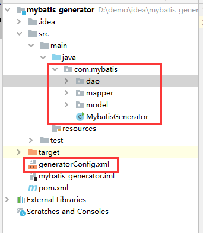

# Mybatis逆向工程代码
简单方便的生成（mapper.java、mapper.xml、pojo…）文件
## 生成结果



## 一、pom.xml添加依赖jar包

```xml
<?xml version="1.0" encoding="UTF-8"?>
<project xmlns="http://maven.apache.org/POM/4.0.0"
         xmlns:xsi="http://www.w3.org/2001/XMLSchema-instance"
         xsi:schemaLocation="http://maven.apache.org/POM/4.0.0 http://maven.apache.org/xsd/maven-4.0.0.xsd">
    <modelVersion>4.0.0</modelVersion>

    <groupId>org.example</groupId>
    <artifactId>mybatis_generator</artifactId>
    <version>1.0-SNAPSHOT</version>

    <dependencies>
        <dependency>
            <groupId>mysql</groupId>
            <artifactId>mysql-connector-java</artifactId>
            <version>8.0.15</version>
        </dependency>

        <dependency>
            <groupId>org.mybatis</groupId>
            <artifactId>mybatis</artifactId>
            <version>3.4.0</version>
        </dependency>

        <dependency>
            <groupId>org.mybatis.generator</groupId>
            <artifactId>mybatis-generator-core</artifactId>
            <version>1.3.7</version>
        </dependency>
    </dependencies>

</project>
```


## 二、编写generatorConfig.xml配置文件

```xml
<?xml version="1.0" encoding="UTF-8"?>
<!DOCTYPE generatorConfiguration
        PUBLIC "-//mybatis.org//DTD MyBatis Generator Configuration 1.0//EN"
        "http://mybatis.org/dtd/mybatis-generator-config_1_0.dtd">
<generatorConfiguration>

    <context id="scm_mysql_tables" targetRuntime="Mybatis3">
        <!-- 防止生成的代码中有很多注释，加入下面的配置控制-->
        <commentGenerator>
            <property name="suppressAllComments" value="true"></property>
        </commentGenerator>

        <!--连接数据库 -->
        <jdbcConnection driverClass="com.mysql.cj.jdbc.Driver"
                        connectionURL="jdbc:mysql://localhost:3306/seckill?useUnicode=true&amp;characterEncoding=utf-8&amp;serverTimezone=GMT"
                        userId="root"
                        password="123456">
        </jdbcConnection>

        <!-- 默认false，把JDBC DECIMAL 和 NUMERIC 类型解析为 Integer，为 true时把JDBC DECIMAL和NUMERIC类型解析为java.math.BigDecimal -->
        <javaTypeResolver>
            <property name="forceBigDecimals" value="false"/>
        </javaTypeResolver>

        <!-- 数据表对应的model层-->
        <javaModelGenerator targetPackage="com.mybatis.model"
                            targetProject="src/main/java">
            <property name="enableSubPackages" value="true" />
            <property name="trimStrings" value="true" />
            <property name="constructorBased" value="true"/>
        </javaModelGenerator>

        <!-- mapper映射文件xml -->
        <sqlMapGenerator targetPackage="com.mybatis.mapper"
                         targetProject="src/main/java">
            <property name="enableSubPackages" value="true" />
        </sqlMapGenerator>

        <!-- mapper接口 -->
        <javaClientGenerator type="XMLMAPPER"
                             targetPackage="com.mybatis.dao"
                             targetProject="src/main/java">
            <property name="enableSubPackages" value="true" />
        </javaClientGenerator>

        <!-- 指定数据库表 -->
        <!--
            tableName:要生成的表名
            domainObjectName:生成后的实例名
            enableCountByExample:Count语句中加入where条件查询，默认true开启
            enableUpdateByExample:Update语句中加入where条件查询，默认true开启
            enableDeleteByExample:Delete语句中加入where条件查询，默认true开启
            enableSelectByExample:Select多条语句中加入where条件查询，默认true开启
            selectByExampleQueryId:Select单个对象语句中加入where条件查询，默认true开启
         -->
        <!-- 示例代码
        <table schema="mybatis" tableName="user" domainObjectName="User"
               enableCountByExample="false" enableUpdateByExample="false"
               enableDeleteByExample="false" enableSelectByExample="false"
               selectByExampleQueryId="false">
        </table>
        -->
        <table tableName="item" ></table>
        <table tableName="item_kill"></table>
        <table tableName="item_kill_success"></table>

    </context>
</generatorConfiguration>
```


## 三、创建运行类MybatisGenerator

```java

import org.mybatis.generator.api.MyBatisGenerator;
import org.mybatis.generator.config.Configuration;
import org.mybatis.generator.config.xml.ConfigurationParser;
import org.mybatis.generator.internal.DefaultShellCallback;

import java.io.File;
import java.util.ArrayList;
import java.util.List;

/**
 * @author xuchao
 * @since 2020/2/26 19:57
 */
public class MybatisGenerator {
    public void generator() throws Exception{

        List<String> warnings = new ArrayList<String>();
        boolean overwrite = true;
        //指定 逆向工程配置文件
        File configFile = new File("generatorConfig.xml");
        ConfigurationParser cp = new ConfigurationParser(warnings);
        Configuration config = cp.parseConfiguration(configFile);
        DefaultShellCallback callback = new DefaultShellCallback(overwrite);
        MyBatisGenerator myBatisGenerator = new MyBatisGenerator(config,
                callback, warnings);
        myBatisGenerator.generate(null);

    }
    public static void main(String[] args) throws Exception {
        try {
            MybatisGenerator mybatisGenerator = new MybatisGenerator();
            mybatisGenerator.generator();
        } catch (Exception e) {
            e.printStackTrace();
        }
    }
}

```

